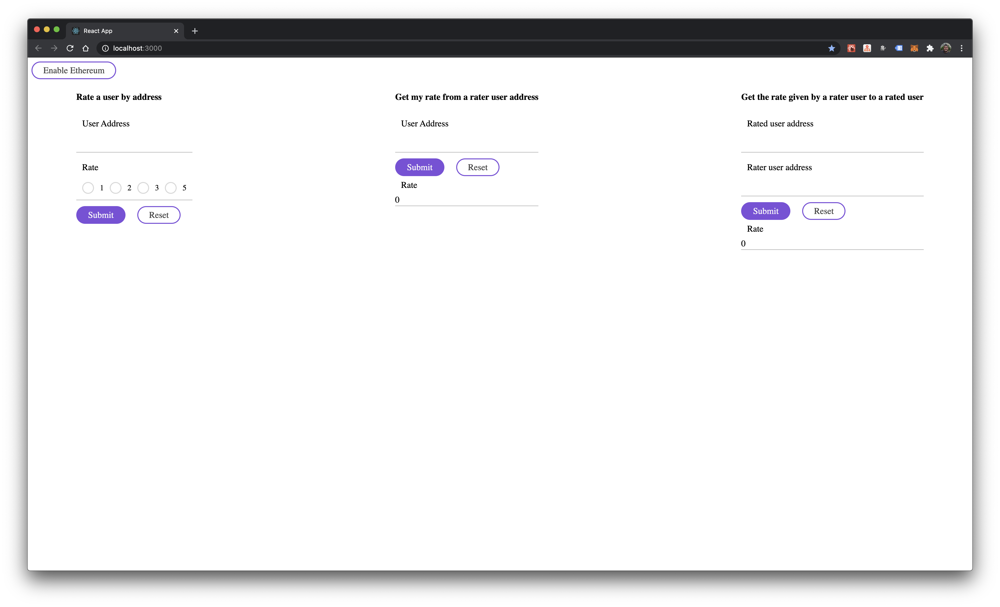

# Rating4 DApp

## Requirements

### Build a P2P rating app
Create a web app where users can rate other users. This is an open problem and you are required to make the necessary assumptions to fulfill the requirements within the time limit. If you are unable to complete under the given time, please document your plan for the rest of the task. Below are the requirements

1 - Every user (known by a unique identifier) can rate another user only once and cannot change rating.
2 - Any user can see who has rated him and when.
3 - Users can see ratings of other users as well (who rated them and when).
4 - The user should also be able to prove the ownership of the identifier (this is optional).

### Implemented and future work

1 - It was fully implemented
2 - User can see the rate but it requires the user to know the address of the rater. For keep tracking of who rate who I would implemented a key pair datastore off chain where it would make a link between the two user address so then we can lookup for the data on chain
3 - Same as above
4 - This can be implemented by checking that the the public key pertains a private key that only the oner of the address know should know it.

## 1. Preview



## Setup

### Prerequisite
- npm
- yarn
- truffle
- ganache-cli

### Install

Install client dependencies

```
cd client
yarn install
```

Compile the smart contract

```
cd blockchain
truffle compile
```

### Run

Run the client app

```
cd client
yarn start
```

Run local Ethereum node

```
ganache-cli --defaultBalanceEther 10000
```

Deploy contract

```
truffle migrate
```

- 10 wallets will be printed in the console with the respective public and private keys so it can be used in the app for testing 
- The contract address will be outputed in the console so you need to set it on the Home.tsx file
- Then you can connect to the node with Metamask chrome extension when in the app through the Enable Ethereum button

## Author

Rodrigo Serviuc Pavezi - rodrigopavezi
